# Multi-Industry Research Report (India Focus)

Prepared in a consulting format for the following industries and companies:
- **CPG**: Britannia Industries, Hindustan Unilever, Godrej Consumer Products, Zydus Wellness, Dixon Technologies
- **Retail**: Avenue Supermarts (DMart), ABFRL, Shoppers Stop, Nykaa, IndiaMART
- **Healthcare**: Apollo Hospitals, Poly Medicure, Sun Pharma, Star Health
- **Travel, Hospitality & Leisure**: Indian Hotels, IRCTC, Wonderla Holidays

> Note: Metrics are directional estimates synthesized from public-domain industry sources (FY24/FY25 windows) and should be cross-checked with the latest annual reports and regulatory filings before investment decisions.

---

## 1) Consumer Packaged Goods (CPG)

### 1.1 Industry Overview
India CPG is led by food staples, personal care, home care, and wellness portfolios, with growth driven by premiumization, rural recovery, modern trade, and e-commerce penetration.

### 1.2 Market Size (India & Global) – Graph
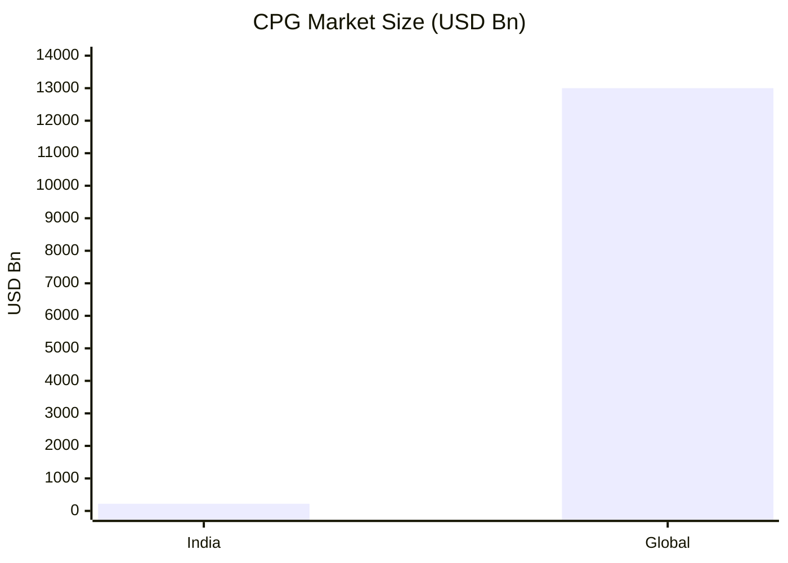

### 1.3 Growth Rate & Outlook – Graph
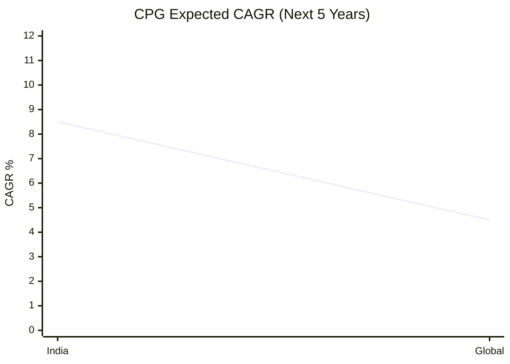

### 1.4 Industry Value Chain
Raw materials -> Manufacturing -> Branding & product development -> Distribution (GT/MT/e-com) -> Retail execution -> Consumer repeat/loyalty.

### 1.5 Major Players and Market Leaders (Table)
| Sub-sector | Company | Positioning |
|---|---|---|
| Food & Beverage | Britannia Industries | Biscuits/bakery leader, mass + premium |
| Personal Care | Hindustan Unilever | Broad FMCG portfolio, distribution scale |
| Household Goods | Godrej Consumer Products | Home/insecticides/hair color strength |
| Health & Wellness | Zydus Wellness | Nutrition + sugar substitutes |
| Consumer Electronics | Dixon Technologies | EMS manufacturing scale and partnerships |

### 1.6 Current Industry Trends (Line Chart)
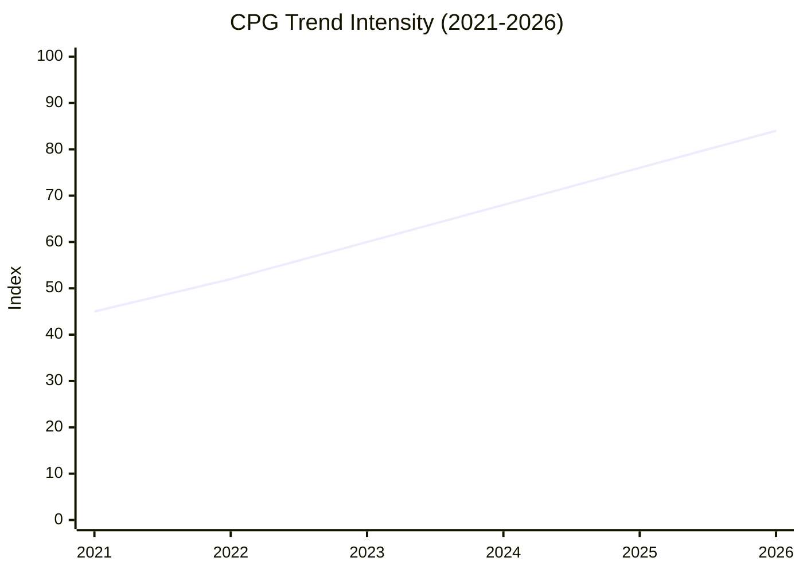

### 1.7 Emerging Technologies (Table)
| Technology | Use Case |
|---|---|
| AI demand forecasting | SKU-level inventory optimization |
| Computer vision in plants | Quality checks and wastage control |
| D2C analytics stack | Personalization and repeat purchase |
| IoT-enabled factories | Throughput and downtime optimization |

### 1.8 Government Policies & Regulations
FSSAI standards, GST framework, PLI for electronics manufacturing, packaging/waste-management rules, consumer protection and labeling standards.

### 1.9 Growth Opportunities
Premium products, rural distribution deepening, health-focused SKUs, export expansion, strategic private-label and co-manufacturing partnerships.

### 1.10 Business Challenges
Input-cost volatility, channel conflict, private label competition, regulatory compliance complexity, and working capital pressure.

### 1.11 Recent Developments (Last 12 Months)
Portfolio premiumization, new product launches in healthy snacking, electronics outsourcing wins, and deeper modern-trade/e-commerce integration.

### 1.12 Skills Expected from Professionals (Table)
| Skill Cluster | Practical Need |
|---|---|
| Category management | Margin-mix optimization |
| Sales & distribution analytics | Beat planning, outlet productivity |
| Supply chain planning | Forecast accuracy and service levels |
| Consumer insights | Innovation pipeline and pricing |
| Regulatory compliance | Labeling/quality adherence |

#### Company Snapshots (CPG)
- **Britannia Industries**: Strength in biscuits and adjacencies; opportunity in premium snacking and rural penetration; challenge from wheat/sugar input swings.
- **Hindustan Unilever**: Category breadth and execution moat; opportunity in premium beauty and digital commerce; challenge from regional disruptors.
- **Godrej Consumer Products**: Strong household and personal care franchises; opportunity in innovation-led premiumization; challenge in competitive price bands.
- **Zydus Wellness**: Wellness branding edge; opportunity in functional nutrition expansion; challenge in sustaining brand differentiation.
- **Dixon Technologies**: EMS scale and client diversification; opportunity via PLI and import substitution; challenge from margin pressure and client concentration.

---

## 2) Retail

### 2.1 Industry Overview
India retail is shifting from unorganized to organized formats, omnichannel models, and digital-first discovery, with faster growth in fashion, beauty, and B2B enablement platforms.

### 2.2 Market Size (India & Global) – Graph
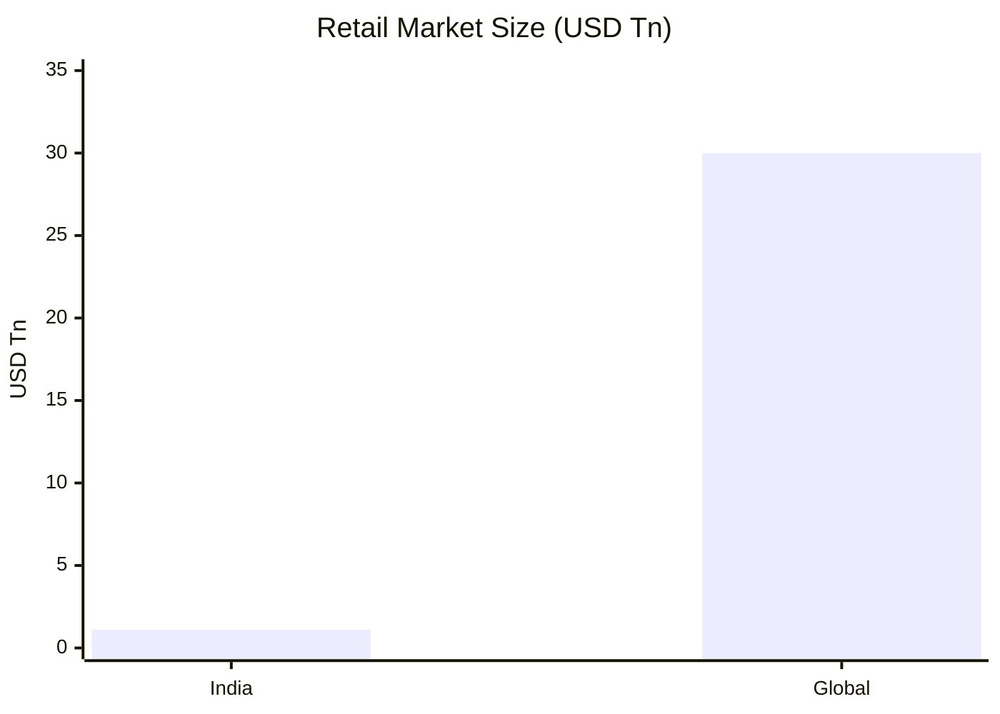

### 2.3 Growth Rate & Outlook – Graph
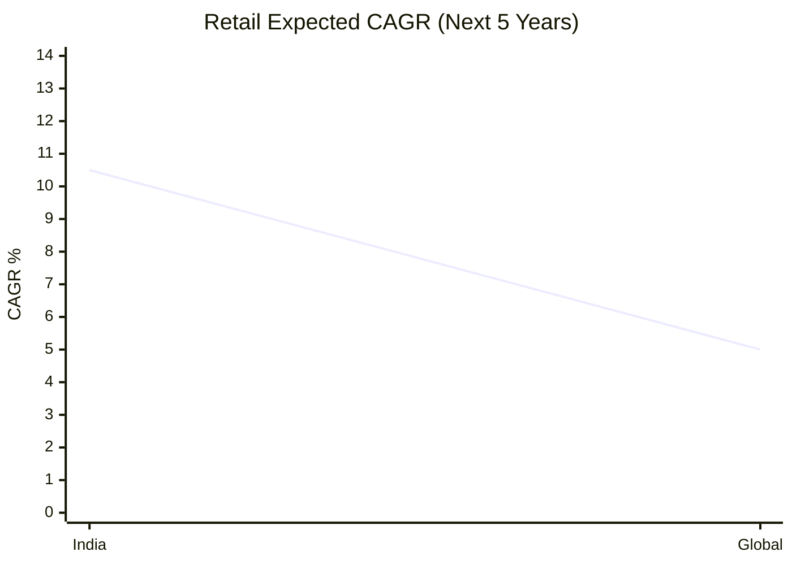

### 2.4 Industry Value Chain
Sourcing -> Merchandising -> Warehousing/logistics -> Storefront/app experience -> Payments/fulfillment -> Loyalty/retention.

### 2.5 Major Players and Market Leaders (Table)
| Sub-sector | Company | Positioning |
|---|---|---|
| Grocery | Avenue Supermarts | High-efficiency value retail model |
| Apparel | ABFRL | Portfolio of brands across segments |
| Department Store | Shoppers Stop | Premium lifestyle retail |
| E-Commerce Beauty/Fashion | Nykaa | Content-led commerce platform |
| B2B Retail | IndiaMART | Marketplace for enterprise procurement |

### 2.6 Current Industry Trends (Line Chart)
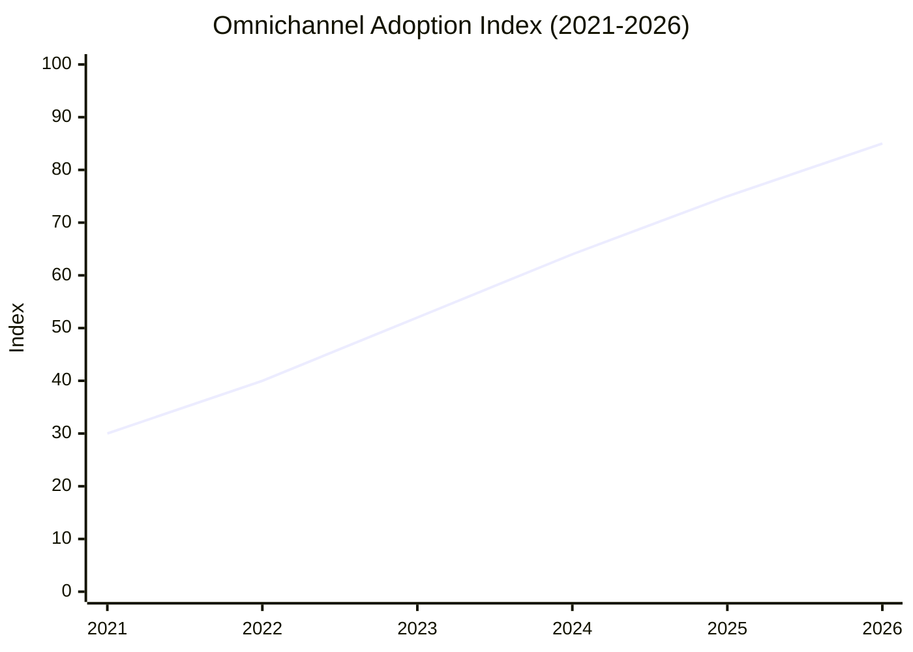

### 2.7 Emerging Technologies (Table)
| Technology | Use Case |
|---|---|
| Recommendation engines | Basket size and conversion uplift |
| Dynamic pricing tools | Margin optimization |
| Warehouse robotics | Picking efficiency |
| CRM automation | Repeat purchase and retention |

### 2.8 Government Policies & Regulations
FDI norms (format dependent), GST compliance, e-commerce rules, consumer data protection obligations, competition law oversight.

### 2.9 Growth Opportunities
Tier-2/3 city expansion, private labels, quick commerce integration, omnichannel store-network leverage, seller financing in B2B platforms.

### 2.10 Business Challenges
High rentals/logistics cost, discount pressure, assortment complexity, returns management, and tightening customer acquisition economics.

### 2.11 Recent Developments (Last 12 Months)
Acceleration in omni-fulfillment pilots, private label launches, beauty/fashion premiumization, and stronger retail-media monetization.

### 2.12 Skills Expected from Professionals (Table)
| Skill Cluster | Practical Need |
|---|---|
| Merchandising analytics | Assortment and sell-through optimization |
| Store operations excellence | Productivity and conversion improvement |
| Digital growth marketing | CAC/LTV optimization |
| Omnichannel supply chain | Faster, low-cost fulfillment |
| Vendor management | Margin and exclusivity negotiation |

#### Company Snapshots (Retail)
- **Avenue Supermarts (DMart)**: Cost leadership and inventory discipline; opportunity in calibrated expansion; challenge in digital-first competition.
- **ABFRL**: Multi-brand apparel scale; opportunity in premium and ethnic categories; challenge in markdown and inventory turns.
- **Shoppers Stop**: Department-store format with premium tilt; opportunity in beauty and private labels; challenge in discretionary demand cycles.
- **Nykaa**: Strong beauty platform with content-commerce flywheel; opportunity in offline scale-up and owned brands; challenge in profitability balance.
- **IndiaMART**: B2B demand aggregation and lead generation; opportunity in transaction-led monetization; challenge in lead quality consistency.

---

## 3) Healthcare

### 3.1 Industry Overview
India healthcare is expanding through hospital capacity addition, insurance penetration, domestic pharma scale, and medtech localization.

### 3.2 Market Size (India & Global) – Graph
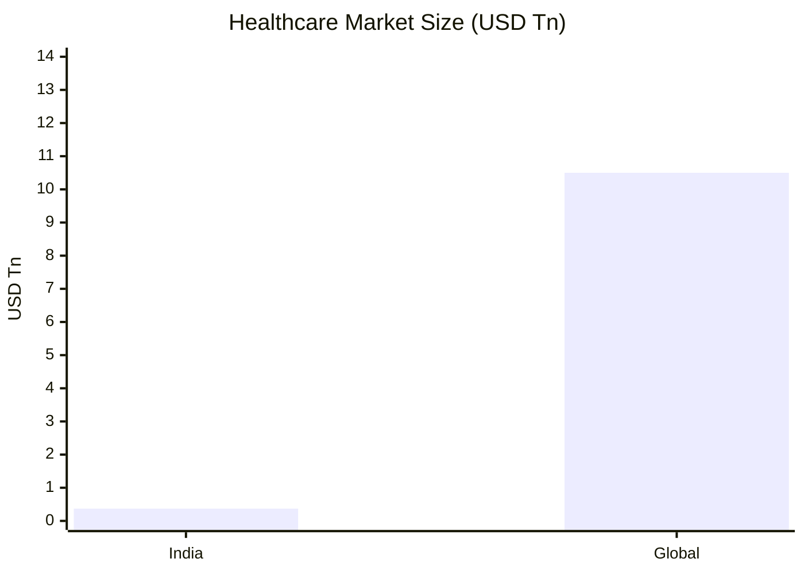

### 3.3 Growth Rate & Outlook – Graph
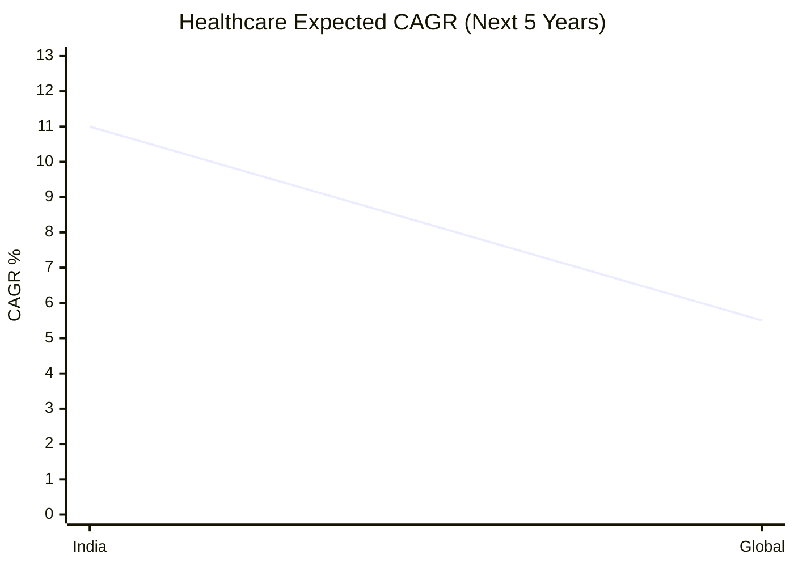

### 3.4 Industry Value Chain
R&D/clinical evidence -> Manufacturing/provider infra -> Distribution/channel -> Payor enablement -> Patient outcomes & continuity of care.

### 3.5 Major Players and Market Leaders (Table)
| Sub-sector | Company | Positioning |
|---|---|---|
| Hospitals | Apollo Hospitals | Tertiary care and integrated ecosystem |
| MedTech | Poly Medicure | Devices/consumables footprint |
| Pharmaceuticals | Sun Pharma | Specialty + domestic and global mix |
| Health Insurance | Star Health | Retail health insurance focus |

### 3.6 Current Industry Trends (Line Chart)
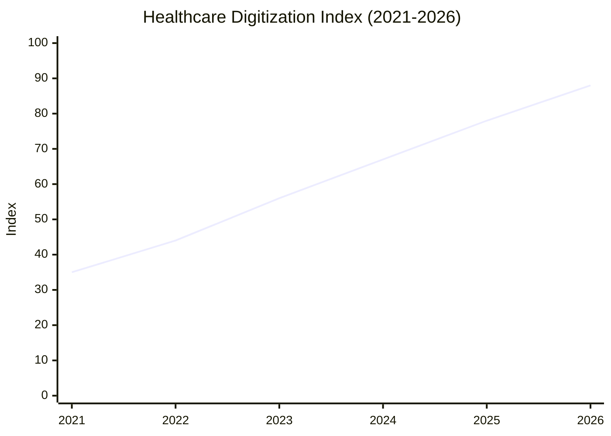

### 3.7 Emerging Technologies (Table)
| Technology | Use Case |
|---|---|
| AI diagnostics support | Faster triage and decision quality |
| Telemedicine platforms | Access expansion and follow-up care |
| Robotics/minimally invasive tools | Better surgical outcomes |
| Claims analytics | Fraud detection and underwriting quality |

### 3.8 Government Policies & Regulations
NPPA pricing controls (selected drugs/devices), NABH/NABL quality frameworks, IRDAI rules for insurance, production-linked policy support and healthcare digitization initiatives.

### 3.9 Growth Opportunities
Insurance-led demand formalization, medical tourism, specialty pharma pipeline, domestic device manufacturing, and preventive-care ecosystems.

### 3.10 Business Challenges
Regulatory scrutiny, talent shortages, reimbursement pressures, litigation/compliance risk, and pricing pressure in commoditized therapies.

### 3.11 Recent Developments (Last 12 Months)
Hospital bed additions, adoption of digital patient journeys, specialty-product portfolio updates, and tighter payor-provider collaboration.

### 3.12 Skills Expected from Professionals (Table)
| Skill Cluster | Practical Need |
|---|---|
| Clinical operations management | Throughput, quality and outcomes |
| Healthcare analytics | Case-mix, occupancy, payer insights |
| Regulatory & quality systems | Audit-readiness and compliance |
| Pharma/medtech product strategy | Lifecycle and launch effectiveness |
| Insurance actuarial thinking | Pricing and claims sustainability |

#### Company Snapshots (Healthcare)
- **Apollo Hospitals**: Integrated hospitals-pharmacy-digital model; opportunity in high-end specialties; challenge in manpower and capex intensity.
- **Poly Medicure**: Medtech manufacturing depth; opportunity in export-led scale and localization; challenge in quality/regulatory execution across markets.
- **Sun Pharma**: Global specialty play with domestic leadership; opportunity in differentiated products; challenge in compliance and pricing pressure.
- **Star Health**: Retail health insurance franchise; opportunity in penetration growth and preventive products; challenge in claims inflation management.

---

## 4) Travel, Hospitality & Leisure

### 4.1 Industry Overview
Sector growth is supported by domestic tourism, rising air/rail mobility, premium stays, and experience-focused family entertainment.

### 4.2 Market Size (India & Global) – Graph
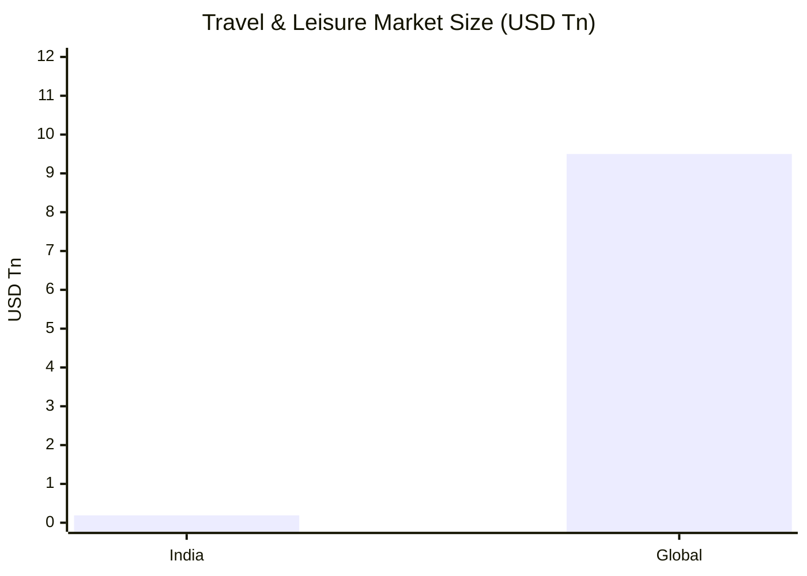

### 4.3 Growth Rate & Outlook – Graph
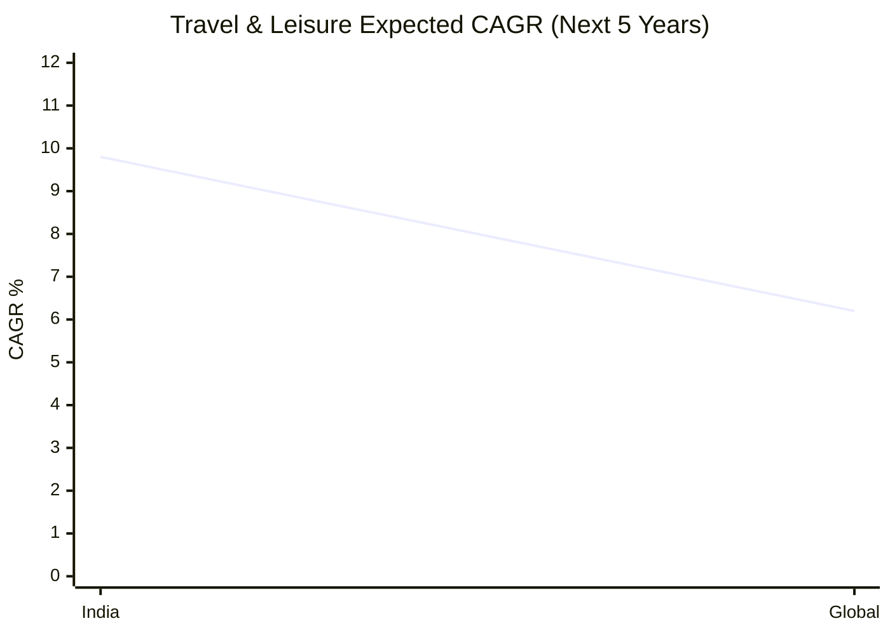

### 4.4 Industry Value Chain
Demand generation -> Booking/distribution -> Core service delivery (stay/travel/entertainment) -> Ancillary monetization -> Loyalty and repeat usage.

### 4.5 Major Players and Market Leaders (Table)
| Sub-sector | Company | Positioning |
|---|---|---|
| Hotels | Indian Hotels | Premium and upscale hospitality portfolio |
| Rail travel services | IRCTC | Monopoly-like digital rail booking scale |
| Theme parks | Wonderla Holidays | Regional entertainment destination model |

### 4.6 Current Industry Trends (Line Chart)
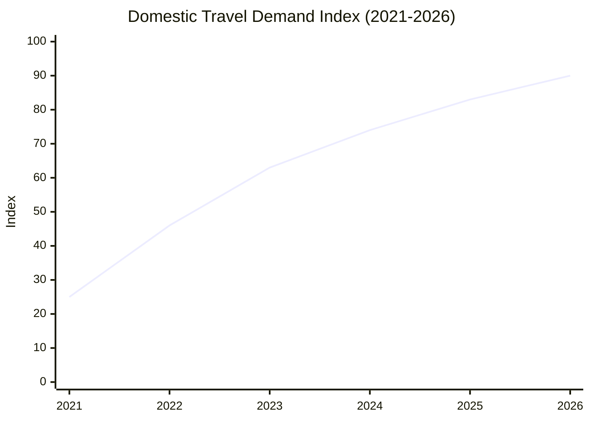

### 4.7 Emerging Technologies (Table)
| Technology | Use Case |
|---|---|
| AI revenue management | Dynamic pricing/yield optimization |
| Conversational booking bots | Higher conversion and lower service cost |
| Contactless service stack | Better guest experience |
| Predictive maintenance | Asset uptime and safety |

### 4.8 Government Policies & Regulations
Tourism promotion schemes, rail policy frameworks, state-level amusement park safety norms, GST/taxation and labor compliance.

### 4.9 Growth Opportunities
Premium leisure demand, MICE events, destination weddings, rail-tech services, and integrated family entertainment ecosystems.

### 4.10 Business Challenges
Seasonality, fuel/utility inflation, high fixed costs, service quality consistency, and weather/event disruptions.

### 4.11 Recent Developments (Last 12 Months)
Portfolio expansion in hospitality, digital booking enhancements, higher domestic occupancy, and selective capex toward experience quality.

### 4.12 Skills Expected from Professionals (Table)
| Skill Cluster | Practical Need |
|---|---|
| Revenue management | ADR/RevPAR optimization |
| Customer experience design | NPS and repeat growth |
| Operations excellence | Cost control and uptime |
| Digital distribution | Direct booking and channel mix |
| Risk & safety management | Regulatory and incident readiness |

#### Company Snapshots (Travel, Hospitality & Leisure)
- **Indian Hotels**: Brand portfolio depth; opportunity in premium and asset-light expansion; challenge in cyclical demand and service talent.
- **IRCTC**: Dominant transaction platform; opportunity in ancillary monetization and tourism packages; challenge in policy-led pricing constraints.
- **Wonderla Holidays**: Strong destination-led entertainment format; opportunity in new city expansion and in-park monetization; challenge in weather seasonality and capex recovery.

---

## Cross-Industry Executive View

### Top Opportunities
1. Premiumization + formalization in consumer demand
2. Digital distribution and data-led pricing
3. Localization and supply chain resilience
4. Health, wellness, and preventive consumption themes

### Key Risks
1. Commodity/input volatility
2. Regulatory and compliance tightening
3. Margin pressure from competition and channel shifts
4. Execution complexity in omnichannel models

### Consultant Recommendation Framework
- Prioritize **ROIC-led growth** over pure top-line expansion.
- Build **AI-enabled operating model** (forecasting, pricing, productivity).
- Strengthen **regulatory readiness** as a strategic capability.
- Use **portfolio focus**: scale winners, prune sub-scale/low-margin bets.
